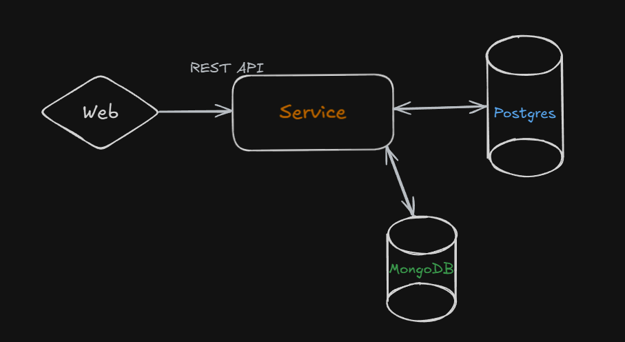

urls:
 + POST 'auth/signup' => ***body:*** nickname, email, password (create new user)
 + 
 + POST '/users/{nickname}/create => ***body:*** title, subtitle (create new post)
 + 
 + GET '/posts' (show all posts)
 + 
 + GET '/users' (show all users) 
 + GET '/users/{nickname}' (show user's info)
 + 
 + GET 'auth/signin' => ***body:*** nickname, password (check user in system)
 + 
 + POST '/feedbacks/create' -- ***body:*** id, title (create new feedback)
 + 
 + GET '/feedbacks' (show all feedback)

***Plan:***
 + delete posts / delete users
 + make GET and user's posts
 + add right exceptions 
 + docker
 + kafka?
 + load balanser?
 + ceph/s3?

--------------------

***System design***
