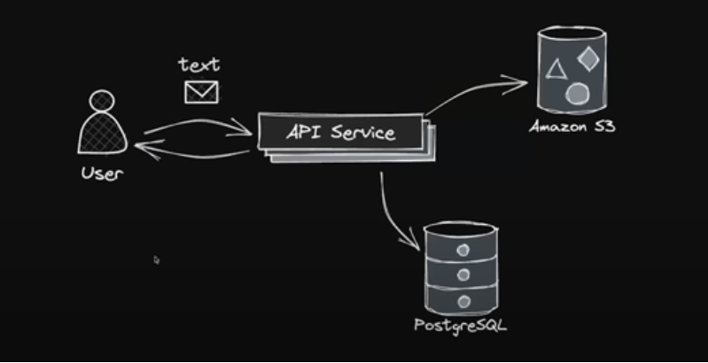
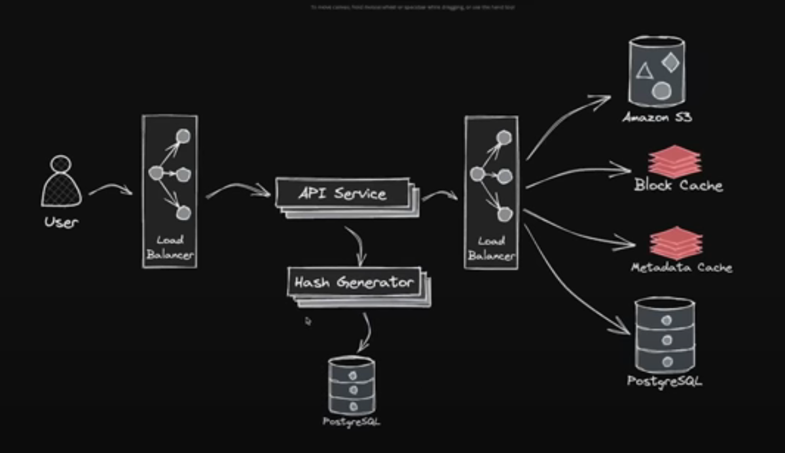

urls:
 + POST 'auth/signup' -- ***body:*** nickname, email, password 
 + POST '/users/{nickname}/create -- ***body:*** title, subtitle
 + GET '/posts' 
 + GET '/users' / GET '/users/{nickname}'
 + GET 'auth/signin' -- ***body:*** nickname, password
 + POST '/feedbacks/create' -- ***body:*** id, title
 + GET '/feedbacks'

***Plan:***
 + delete posts / delete users
 + make GET and user's posts
 + draw a new system design
 + add right exceptions 
 + docker
 + kafka?
 + load balanser?
 + ceph/s3?

now

later
